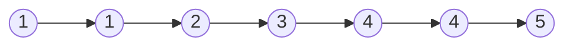
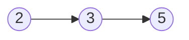

视频 4 分 30 秒：[灵茶山艾府](https://www.bilibili.com/video/BV1VP4y1Q71e/?vd_source=c3f550faf1e5f336955f3fdd676c4462)

```c++
class Solution {
public:
    ListNode *deleteDuplicates(ListNode *head) {
        ListNode *dummy = new ListNode(0, head), *cur = dummy;
        //dummy节点是当遇到了有可能会删除头结点时才有可能用到
        while(cur->next&&cur->next->next){
            int tem=cur->next->val;
            if(cur->next->next->val==tem){
            //这个if里面是只要后面两个元素相同就要一直将cur->next指向下一个不同于这两个元素val值的节点
                while(cur->next&&cur->next->val==tem){
                    ListNode* tem2=cur->next;
                    cur->next=cur->next->next;
                    delete tem2;
                }
            }
            else{
                cur=cur->next;
            }
        }
        return dummy->next;
    }
};
```
